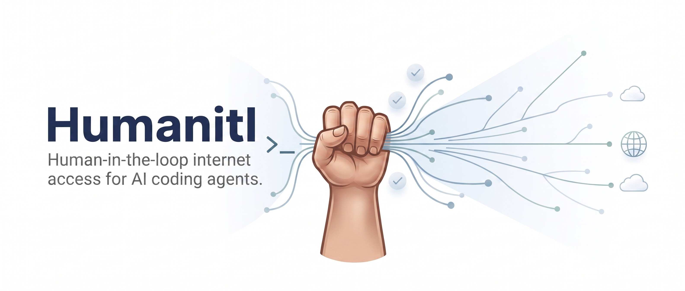

<p align="center">
  <a href="https://github.com/nurkert/Humanitl/actions/workflows/ci.yml"></a>
  <a href="LICENSE"></a>
  
  
</p>

---

Humanitl lets you give an AI coding agent access to the internet without giving
up control over what leaves your machine. The agent runs in a sandbox that has
no network interface. Its only way out is a moderating proxy on the host: every
request is held, shown to you with headers, parameters and body, and is sent only
after you allow it. Rules take care of the traffic you already trust. Everything
is recorded.

The agent talks to a language model on your own network. Nothing else reaches
the internet unless you release it.

## Contents

- [Why](#why)
- [How it holds](#how-it-holds)
- [What you get](#what-you-get)
- [How it works](#how-it-works)
- [Installation](#installation)
- [Quick start](#quick-start)
- [Configuration](#configuration)
- [Security](#security)
- [Project status and roadmap](#project-status-and-roadmap)
- [Contributing](#contributing)
- [Licence](#licence)
- [Acknowledgements](#acknowledgements)

## Why

Local language models are becoming good enough for real work, and at the same
time they know less by heart and need to look things up. An agent with internet
access can put sensitive data from your project into a request and send it
away, through prompt injection, a malicious package, or a manipulated model.
Today the only safe answer is "no internet". Humanitl makes internet possible,
under human control, traceable and recorded.

It is built for professionals who handle client data and have obligations
under the GDPR, who sit next to the agent while it works, and who are not
necessarily security experts.

## How it holds

The security argument fits in three sentences, and each one can be verified
from inside the running sandbox.

1. **No network interface.** The sandbox runs in its own network namespace with
   only a loopback device and an empty routing table. No address, no DNS, no
   ICMP, no QUIC, no capabilities.
2. **One door.** A single Unix socket, bind-mounted into the sandbox as a file,
   leads to the proxy on the host. Nothing else from the host's runtime
   directory, X11, Wayland, D-Bus or Docker is mounted.
3. **No new doors.** A seccomp filter allows `socket()` only for TCP over IPv4
   and IPv6 and refuses every other family and type. Loopback is all that
   namespace has, so an allowed socket reaches the proxy and nothing else.

The same approach is used by the sandboxes of Claude Code and the OpenAI Codex
CLI. Humanitl adds the human in the loop and the user interface around it. You
can run all three checks from the application at any time, and the exact
sandbox command line is one click away.

Two channels are deliberately open and are shown as such: the project directory
the agent works in, and the connection to your language model. Both are
documented in [`docs/SECURITY.md`](docs/SECURITY.md), along with what the
guarantees do not cover; the attacker model is in
[`docs/THREAT-MODEL.md`](docs/THREAT-MODEL.md).

## What you get

| Capability | Description | Status |
|---|---|---|
| Intercept queue | Every request held as a card: method, host, path, query, headers, body as JSON tree, form or raw; secrets and personal data highlighted inline | planned, M2 |
| Decide | Allow, allow edited, or block with a note the agent can read; remember as a rule for once, this session, or forever, scoped to URL, host, domain or domain and method | planned, M2 |
| Rules | Ordered allow, block and ask rules on host globs, method, path, scheme and port; default is ask; temporary session rules shown separately | planned, M2 |
| History and export | Everything recorded in SQLite, searchable, exportable as HAR, JSONL and CSV | planned, M2 |
| Agent inside | OpenCode running in the sandbox against Ollama, vLLM, LM Studio or llama.cpp on your LAN; terminal in the app; agent briefing so it knows where it runs | planned, M3 |
| Isolation check | The three guarantees verified live in the running sandbox, shown as a ring in the header | planned, M3 |
| `humanitl run` | The same thing from the command line, in any directory, with a profile that allows only the language model | planned, M3 |
| Pseudonymisation | Replace personal data before sending, stable per session, translated back in text responses; mapping stays on the host, encrypted | planned, M4 |
| Audit log | Append-only, hash-chained, exportable; honest about what it proves | planned, M4 |
| Settings | Three decisions to get started; everything else configurable with progressive disclosure, one schema feeding the app, the CLI and the docs | planned, M4 |
| Packages | `.deb` and AppImage, one click to enable the background service | planned, M4 |

Later: Docker sandbox backend, a browser for the agent with live view and
takeover, upstream proxy and Tor, macOS, micro-VM isolation, plugins. The full
plan with milestones, sprints and every issue is in [`BACKLOG.md`](BACKLOG.md).

## How it works

```
+-----------------------------+   gRPC over Unix socket   +-------------------------------+
| humanitl  (Flutter desktop) | <-----------------------> | humanitld  (Rust daemon)      |
| humanitl  (command line)    |   one contract, thin      |  proxy · rules · findings     |
+-----------------------------+   clients                 |  recorder · audit · sandbox   |
                                                          +---------------+---------------+
                                                                          | exactly one Unix socket
                                                          +---------------v---------------+
                                                          | sandbox  (bubblewrap)         |
                                                          |  no network interface         |
                                                          |  shim: bridge, seccomp, exec  |
                                                          |  agent  (OpenCode)            |
                                                          |  /work  (your project)        |
                                                          +-------------------------------+
                                                     LAN language model (passthrough, logged)
                                                     Internet (only after you allow)
```

- **Daemon** (`daemon/`): Rust. A MITM proxy built on hudsucker holds each
  request until a decision arrives, evaluates rules, scans for findings,
  records to SQLite and writes the audit chain. It launches the sandbox and
  serves the gRPC contract on a Unix socket.
- **Sandbox**: bubblewrap with `--unshare-all`, a tiny dependency-free shim
  that brings up the socket bridge, applies seccomp and executes the agent.
- **Clients** (`app/`, `daemon/bin/humanitl`): the Flutter desktop application
  and the command line are thin clients of the same contract. Every capability
  is an RPC first; neither client contains domain logic.
- **Core crates** carry no IO, no async and no protobuf, so the rules engine,
  the flow state machine, the findings detectors and the audit chain are pure
  functions with table-driven tests.

The architecture guideline, including the dependency rules that CI enforces, is
in [`docs/ARCHITECTURE.md`](docs/ARCHITECTURE.md). Decisions are recorded as
ADRs under [`docs/adr/`](docs/adr/).

## Installation

There is no release yet. When the first snapshot ships it will be available
from the [releases page](https://github.com/nurkert/Humanitl/releases) as a
`.deb` for Debian and Ubuntu and as an AppImage, built by GitHub Actions from
a signed tag.

```sh
sudo apt install ./humanitl_<version>_amd64.deb
humanitl            # starts the desktop application
humanitl doctor     # checks bubblewrap, user namespaces, seccomp, systemd
```

Runtime requirements: Linux with unprivileged user namespaces, `bubblewrap`
0.8 or newer, a systemd user session, and a language model reachable on your
network. `humanitl doctor` tells you what is missing and how to fix it.

## Quick start

For development, today:

```sh
git clone https://github.com/nurkert/Humanitl.git
cd Humanitl
make check          # builds and tests both toolchains
make help           # every target
```

Toolchain: Rust 1.88 or newer, Flutter 3.44 or newer. See
[`CONTRIBUTING.md`](CONTRIBUTING.md) for the details, including how the local
gate behaves when `rustfmt` or `clippy` are absent.

When the first milestones land, the everyday start will be:

```sh
cd ~/projects/client-acme
humanitl run                       # cwd as /work, discovered LLM, OpenCode, ask by default
humanitl run --profile llm-only    # only the language model, everything else blocked
```

## Configuration

Three decisions get you started: where your language model is, which folder
the agent may see, and start. Everything else is configurable and lives in one
place.

- `~/.config/humanitl/config.toml` holds the settings. Every key has a tier
  (basic, advanced, expert), a description and a default; the settings screen,
  the CLI flags and the reference documentation are generated from the same
  schema.
- `~/.config/humanitl/rules.yaml` holds persistent rules. Session rules live
  only in memory and are shown separately.
- Profiles bundle sandbox, rules, agent, language model and timeouts. A
  project-local `.humanitl/profile.toml` overrides the global profile.
- Precedence, lowest to highest: built-in defaults, global config, global
  profile, project profile, environment (`HUMANITL_HOLD__TIMEOUT_SECS`),
  command line flag. The app shows where each value came from.

## Security

Please read [`docs/SECURITY.md`](docs/SECURITY.md) before relying on Humanitl
for sensitive work. It states the three guarantees, the two channels that stay
open by design, what the audit chain does and does not prove, and what is out
of scope.

To report a vulnerability, do not open a public issue. Use the contact given in
`docs/SECURITY.md`. We aim to acknowledge reports within a few days.

## Project status and roadmap

Humanitl is in early development. Nothing is released and nothing should be
relied upon yet. The work is organised in six sprints towards a first usable
version:

| Milestone | Delivers |
|---|---|
| M0 Foundation | monorepo, CI, protobuf contract, core types, fake daemon, escape-test harness |
| M1 Sealed box | sandbox provably closed, proxy holds a request |
| M2 First decision | rules, findings, recorder, intercept and history screens |
| M3 Agent inside | OpenCode against a LAN model, terminal, isolation check, `humanitl run` |
| M4 Trusted editor | pseudonymisation, audit chain, settings, German and English, packages |
| M5 Release 0.1 | fuzzing, limits, error paths, documentation, signed release |

Progress is visible in the commit history, one issue per commit.

## Contributing

Contributions are welcome once the foundation has landed. Until then the most
useful thing is to read [`BACKLOG.md`](BACKLOG.md) and
[`docs/SECURITY.md`](docs/SECURITY.md) and tell us where the reasoning is wrong.

- [`CONTRIBUTING.md`](CONTRIBUTING.md): toolchain, workflow, commit format,
  definition of done.
- [`backlog/CONVENTIONS.md`](backlog/CONVENTIONS.md): the names, types and
  paths every part of the code base agrees on.
- [`CLAUDE.md`](CLAUDE.md) and [`AGENTS.md`](AGENTS.md): rules for AI
  sessions and briefings for reviewer agents. Every change is reviewed by two
  independent models before it is merged.

Planning documents are currently in German; the code, identifiers and commit
messages are English. The whole repository moves to English before the first
release.

## Licence

GPL-3.0-only. See [`LICENSE`](LICENSE).

## Acknowledgements

The isolation model follows the Linux sandboxes of
[Claude Code](https://github.com/anthropic-experimental/sandbox-runtime) and
the [OpenAI Codex CLI](https://github.com/openai/codex). The proxy is built on
[hudsucker](https://github.com/omjadas/hudsucker), the sandbox on
[bubblewrap](https://github.com/containers/bubblewrap). The interception
workflow borrows from Burp Suite, OWASP ZAP and Little Snitch; the domain data
from the [Public Suffix List](https://publicsuffix.org/) and
[Tranco](https://tranco-list.eu/).
